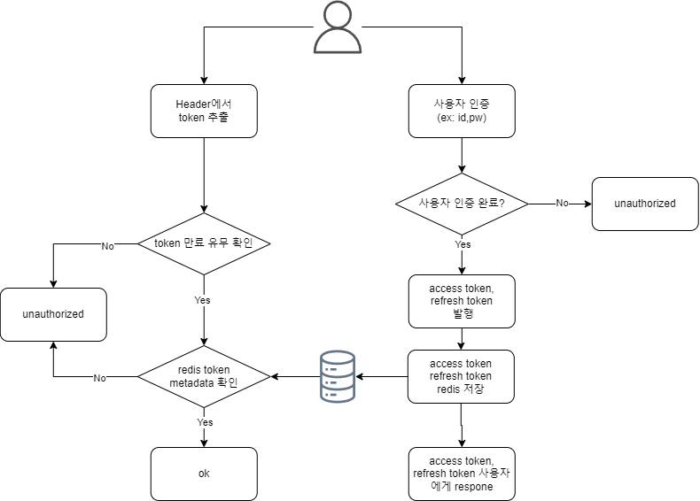

# golang jwt token api server
   

### 사용 패키지
```
go get gopkg.in/ini.v1
go get -u github.com/gin-gonic/gin
go get -u github.com/golang-jwt/jwt/v5
go get github.com/google/uuid
go get github.com/redis/go-redis/v9
go get -u gorm.io/gorm
go get -u gorm.io/driver/mysql
```

### 주요 기능
1. 토큰 생성
2. 권한 등록
3. 토큰 검증
4. 권한 삭제
5. refresh token

### 프로세스

```
POST /auth/login
POST /auth/reissue
POST /auth/logout
POST /auth/check
```

### Conf
ini 파일을 통한 app config 가능 `conf/app.ini`
```
[server]
#debug or release
RunMode = debug
HttpPort = 8000
ReadTimeout = 60
WriteTimeout = 60

[redis]
Host = 127.0.0.1:6379
Password =
MaxIdle = 30
MaxActive = 30
IdleTimeout = 200
...
```

### 도커 설정 
도커 파일을 이용한 image 생성 가능
`deployments/Dockerfile`
```
FROM golang:alpine AS builder

RUN mkdir -p /build
WORKDIR /build

COPY go.mod .
COPY . .
RUN go build -o main example1.go

RUN mkdir -p /dist
WORKDIR /dist
RUN cp /build/main ./main

EXPOSE 8001
CMD ["./main"]
```
### 젠킨스 설정 
젠킨스 파일을 이용한 pipeline 구성 가능
`deployments/Jenkinsfile`
```
pipeline {
    agent any
    options {
        timeout(time: 1, unit: 'HOURS')
    }
    environment {
        SOURCECODE_JENKINS_CREDENTIAL_ID = 'github-access-token'
        SOURCE_CODE_URL = 'https://github.com/jbground/youth-phone-vue.git'
        RELEASE_BRANCH = 'main'
    }
    stages {
        stage('clone') {
            steps {
                git url: "$SOURCE_CODE_URL",
                    branch: "$RELEASE_BRANCH",
                    credentialsId: "$SOURCECODE_JENKINS_CREDENTIAL_ID"
                sh "ls -al"
            }
        }
    }
}
```

### Run
```
$ go run cmd/main.go 
```

## Features
- RESTful API
- Gorm
- Gin

## References
- github.com/eddycjy/go-gin-example
- github.com/ardanlabs/service